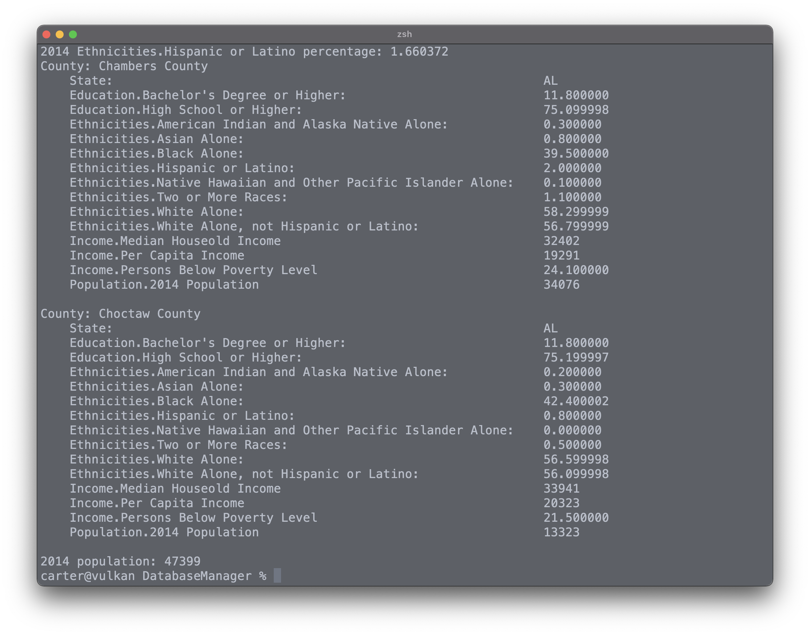

# Database Manager

Utilize various operations and commands to derive meaning from the [CORGIS](https://corgis-edu.github.io/corgis/) open-source dataset.

## Usage

```
./manage_data <CORGIS-Data.csv> <Operations-File.ops>
```



## Valid Operations File Commands
The following displays the database manager's valid commands with proper syntax.
```
// Display current working dataset.
display

// Filter current working dataset by state.
filter-state:<state>

// Filter current working dataset by rates of education or employment.
filter:<education>:<le/ge>:<percentage>

// Display population of specific ethnicity, education or employment of the working dataset.
population:<ethnicity><education><employment>

// Display percent of ethnicity, education, or employment of the working dataset.
percent:<ethnicity><education><employment>

// Display total 2014 population.
population-total
```

#### Example Operations File
```
filter-state:AL
population-total
filter:Education.Bachelor's Degree or Higher:le:12.000000
population:Ethnicities.Hispanic or Latino
percent:Ethnicities.Hispanic or Latino
display
population-total
```

#### Expected Output
Given the example operations file the following image illustrates the expected output.


## Contributing
Pull requests are welcome. For major changes, please open an issue first to discuss what you would like to change.

Please make sure to update tests as appropriate.

## License
[MIT](https://choosealicense.com/licenses/mit/)
